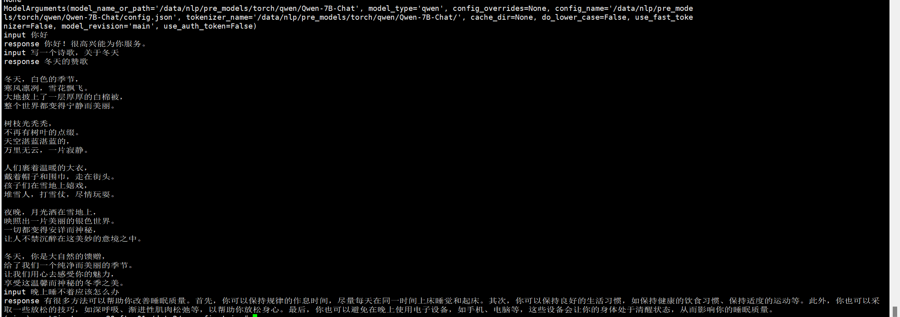

##  statement
- [deep_training](https://github.com/ssbuild/deep_training)

```text
    10-09 support accelerator trainer
    10-07 support colossalai trainer
    09-26 support transformers trainer
    09-25 0.2.4 support qwen-7b 新版 和 qwen-14b ， 旧版不再支持，旧版可以安装 deep_training <= 0.2.3
                support transformers trainer
    08-11 aigc-zoo 0.1.17.post0 update config , 更新下官方权重配置文件 
    dev 分支加一些新功能和想法 如果求稳定，请使用 stable分支

```
   


## install
  - pip install -U -r requirements.txt
  - 如果无法安装 , 可以切换官方源 pip install -i https://pypi.org/simple -U -r requirements.txt  

```text

# flash-attention对显卡算例要求算力7.5 以上 ， 下面可选安装 ，如果卡不支持可以不安装。
git clone -b v1.0.8 https://github.com/Dao-AILab/flash-attention
cd flash-attention && pip install .
pip install csrc/layer_norm
pip install csrc/rotary
```


## weight

 - [Qwen-7B](https://huggingface.co/Qwen/Qwen-7B)
 - [Qwen-7B-Chat](https://huggingface.co/Qwen/Qwen-7B-Chat)
 - [Qwen-14B](https://huggingface.co/Qwen/Qwen-14B)
 - [Qwen-14B-Chat](https://huggingface.co/Qwen/Qwen-14B-Chat)


## data sample
   [open_data](https://github.com/ssbuild/open_data)
   [react_prompt](assets/react_prompt.md)
    
数据示例
```text
数据示例
例子依次分别是 工具，对话，对话，对话

数组组成 
tools:  工具函数,可选字段(str)，为 json.dumps 序列化后的字符串，参考 data/make_data_example.py 
role: 可选字段(str) 标志 q字段 角色, one of user system, observation ，system 标识是否为 system prompt , system prompt a 空 
observation 配合tools，不是函数 ，tools键值不应存在。例子参考data/make_data_example.py 
q: 问题
a: 回答

注意事项:
a字段：对于普通对话，a即为回答。
细节可以参考 assets/react_prompt.md
```

```json
{"id": 1, "paragraph": [{"role": "system", "q": "Answer the following questions as best you can. You have access to the following tools:", "tools": " \n[\n    {\n        'name_for_human':\n        '夸克搜索',\n        'name_for_model':\n        'quark_search',\n        'description_for_model':\n        '夸克搜索是一个通用搜索引擎，可用于访问互联网、查询百科知识、了解时事新闻等。',\n        'parameters': [{\n            'name': 'search_query',\n            'description': '搜索关键词或短语',\n            'required': True,\n            'schema': {\n                'type': 'string'\n            },\n        }],\n    },\n    {\n        'name_for_human':\n        '通义万相',\n        'name_for_model':\n        'image_gen',\n        'description_for_model':\n        '通义万相是一个AI绘画（图像生成）服务，输入文本描述，返回根据文本作画得到的图片的URL',\n        'parameters': [{\n            'name': 'query',\n            'description': '中文关键词，描述了希望图像具有什么内容',\n            'required': True,\n            'schema': {\n                'type': 'string'\n            },\n        }],\n    },\n]\n", "a": ""}, {"role": "user", "q": "现在给我画个五彩斑斓的黑", "a": "\nThought: 我应该使用通义万相API来生成一张五彩斑斓的黑的图片。\nAction: image_gen\nAction Input: {\"query\": \"五彩斑斓的黑\"}\n            "}, {"role": "observation", "q": "\n{\"status_code\": 200, \"request_id\": \"3d894da2-0e26-9b7c-bd90-102e5250ae03\", \"code\": null, \"message\": \"\", \"output\": {\"task_id\": \"2befaa09-a8b3-4740-ada9-4d00c2758b05\", \"task_status\": \"SUCCEEDED\", \"results\": [{\"url\": \"https://dashscope-result-sh.oss-cn-shanghai.aliyuncs.com/1e5e2015/20230801/1509/6b26bb83-469e-4c70-bff4-a9edd1e584f3-1.png\"}], \"task_metrics\": {\"TOTAL\": 1, \"SUCCEEDED\": 1, \"FAILED\": 0}}, \"usage\": {\"image_count\": 1}}\n", "a": "\nThought: 我已经成功使用通义万相API生成了一张五彩斑斓的黑的图片。\nFinal Answer: 我已经成功使用通义万相API生成了一张五彩斑斓的黑的图片https://dashscope-result-sh.oss-cn-shanghai.aliyuncs.com/1e5e2015/20230801/1509/6b26bb83-469e-4c70-bff4-a9edd1e584f3-1.png。\n            "}]}
{"id": 2, "paragraph": [{"q": "从南京到上海的路线", "a": "你好，南京到上海的路线如下：\n1. 南京到上海，可以乘坐南京地铁1号线，在南京站乘坐轨道交通1号线。\n2. 南京到浦东机场，可以搭乘上海地铁1号，在陆家嘴站乘坐地铁1线，在浦东国际机场站乘坐机场快线，前往上海浦东国际机场。\n3. 上海到南京，可以换乘上海地铁2号线，从南京站换乘地铁2线，再从南京南站换乘地铁1路，然后到达上海站"}]}
{"id": 3, "paragraph": [{"q": "写一个诗歌，关于冬天", "a": "冬夜寂静冷，\n云在天边飘，\n冰封白雪上， \n寒冷像一场雪。\n \n雪花融化成冰，\n像那雪花飘洒，\n在寒冷的冬天，\n感受春天的喜悦。\n 冬日里，\n风雪渐消，\n一片寂静，\n把快乐和温暖带回家。"}]}
{"id": 4, "paragraph": [{"q": "晚上睡不着应该怎么办", "a": "晚上睡不着可能会让你感到焦虑或不舒服,但以下是一些可以帮助你入睡的方法:\n\n1. 制定规律的睡眠时间表:保持规律的睡眠时间表可以帮助你建立健康的睡眠习惯,使你更容易入睡。尽量在每天的相同时间上床,并在同一时间起床。\n2. 创造一个舒适的睡眠环境:确保睡眠环境舒适,安静,黑暗且温度适宜。可以使用舒适的床上用品,并保持房间通风。\n3. 放松身心:在睡前做些放松的活动,例如泡个热水澡,听些轻柔的音乐,阅读一些有趣的书籍等,有助于缓解紧张和焦虑,使你更容易入睡。\n4. 避免饮用含有咖啡因的饮料:咖啡因是一种刺激性物质,会影响你的睡眠质量。尽量避免在睡前饮用含有咖啡因的饮料,例如咖啡,茶和可乐。\n5. 避免在床上做与睡眠无关的事情:在床上做些与睡眠无关的事情,例如看电影,玩游戏或工作等,可能会干扰你的睡眠。\n6. 尝试呼吸技巧:深呼吸是一种放松技巧,可以帮助你缓解紧张和焦虑,使你更容易入睡。试着慢慢吸气,保持几秒钟,然后缓慢呼气。\n\n如果这些方法无法帮助你入睡,你可以考虑咨询医生或睡眠专家,寻求进一步的建议。"}]}
```


## infer
    # infer.py 推理预训练模型
    # infer_finetuning.py 推理微调模型
    # infer_lora_finetuning.py 推理lora微调模型
     python infer.py


| **量化等级**    | **最低 GPU 显存** |
| -------------- | ----------------- |
| FP16（无量化）   | 13 GB             |
| INT8           | 10 GB              |
| INT4           | 6 GB               |

   




## training
```text
    # 制作数据
    cd scripts
    bash train_full.sh -m dataset 
    or
    bash train_lora.sh -m dataset 
    or
    bash train_ptv2.sh -m dataset 
    
    注: num_process_worker 为多进程制作数据 ， 如果数据量较大 ， 适当调大至cpu数量
    dataHelper.make_dataset_with_args(data_args.train_file,mixed_data=False, shuffle=True,mode='train',num_process_worker=0)
    
    # 全参数训练 
        bash train_full.sh -m train
        
    # lora adalora ia3 
        bash train_lora.sh -m train
        
    # ptv2
        bash train_ptv2.sh -m train
```

## 训练参数
[训练参数](args.MD)


## 友情链接

- [pytorch-task-example](https://github.com/ssbuild/pytorch-task-example)
- [chatmoss_finetuning](https://github.com/ssbuild/chatmoss_finetuning)
- [chatglm_finetuning](https://github.com/ssbuild/chatglm_finetuning)
- [chatglm2_finetuning](https://github.com/ssbuild/chatglm2_finetuning)
- [chatglm3_finetuning](https://github.com/ssbuild/chatglm3_finetuning)
- [t5_finetuning](https://github.com/ssbuild/t5_finetuning)
- [llm_finetuning](https://github.com/ssbuild/llm_finetuning)
- [llm_rlhf](https://github.com/ssbuild/llm_rlhf)
- [chatglm_rlhf](https://github.com/ssbuild/chatglm_rlhf)
- [t5_rlhf](https://github.com/ssbuild/t5_rlhf)
- [rwkv_finetuning](https://github.com/ssbuild/rwkv_finetuning)
- [baichuan_finetuning](https://github.com/ssbuild/baichuan_finetuning)
- [internlm_finetuning](https://github.com/ssbuild/internlm_finetuning)
- [qwen_finetuning](https://github.com/ssbuild/qwen_finetuning)
## 
    纯粹而干净的代码


## Reference
    https://github.com/QwenLM/Qwen-7B


## Star History

[](https://star-history.com/#ssbuild/qwen_finetuning&Date)

